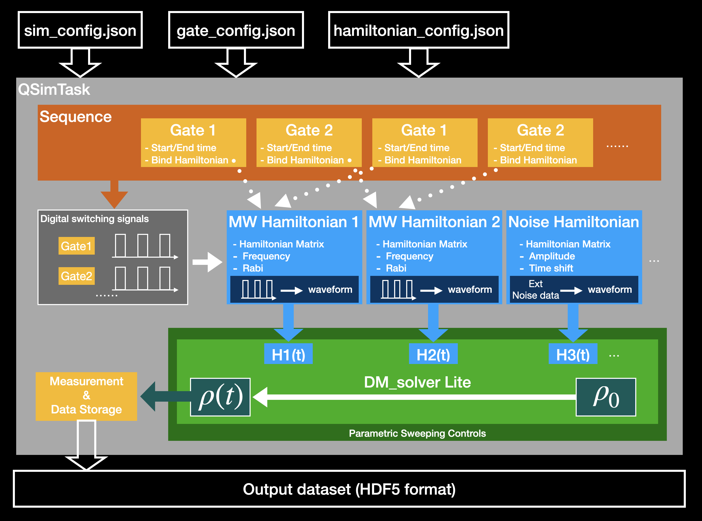

# MewtwoMegaEvo

Mewtwo refactoring project;
Re-developed from DM_Solver

##Compiler CMake Requirement
1. gcc-8.1+
2. CMake 11.0+

##Package Requirements
1. Armadillo 9.x+
2. openMP (Embeded in gcc)
3. Json (nlohmann::json Fetched by CMake)
4. HDF5

##Design
