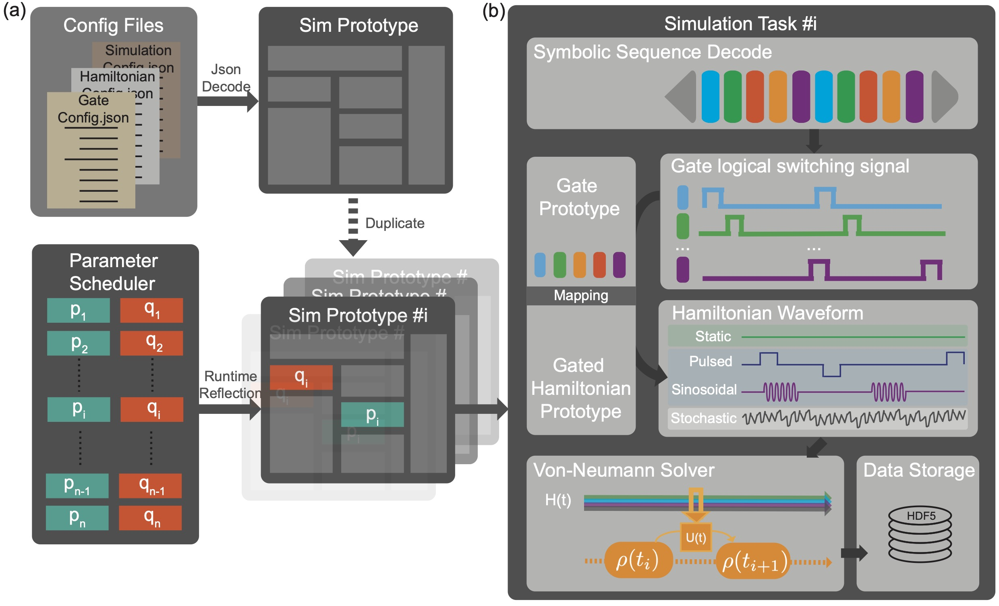
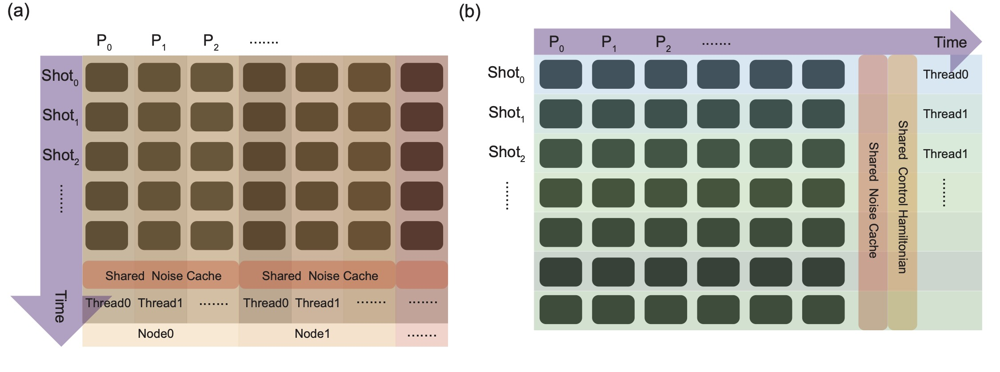
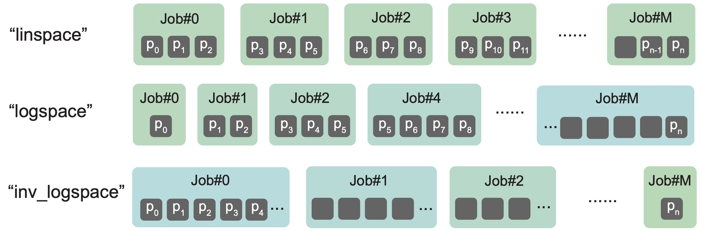
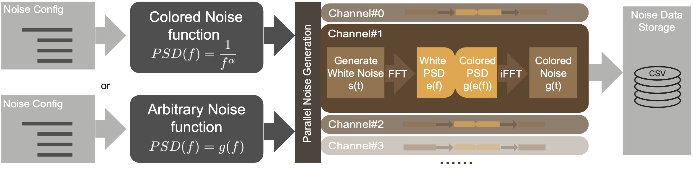

# MewtwoMegaEvo

## 1. Intro
Mewtwo is a density matrix solver based on the Von-Neumann equation, integrated with symbolic gate and sequence parsing and compiling.
Written in C++, this software is designed for very large scale qubits dynamic simulation by harnessing the power of parallelisation and job slicing for high performance computer.
In a nutshell, the core functionality of this software is to solve the time-dependent evolution of the density matrix with the provided time-dependent Hamiltonians.

## 2. Installation

### Quick install (recommended)

One script builds the C++ simulator **and** sets up the Python web-app env, on
**macOS, Ubuntu, or WSL**, picking the right Armadillo BLAS backend automatically
(Accelerate on macOS, Intel oneMKL on Intel, OpenBLAS on AMD):

```bash
./install.sh
```

It installs any missing prerequisites (Homebrew/apt packages, `uv`, `conan`), runs
`conan install` + `cmake`, and `uv sync`. Useful options:

```bash
./install.sh --blas=openblas   # force a backend: mkl | openblas | accelerate
./install.sh --skip-cpp        # only set up the Python env
./install.sh --skip-python     # only build the C++ binaries
./install.sh --jobs=8 -y       # parallelism + non-interactive
```

On an Intel Linux box, `--blas=mkl` (the auto default there) will offer to install
Intel oneMKL via the OneAPI apt repo; decline and it falls back to OpenBLAS.

After it finishes:

```bash
uv run uvicorn webapp.main:app --host 0.0.0.0 --port 8000
```

The manual steps below are still available if you prefer to do it by hand.

### Best performance recommendations
Mewtwo is a high efficiency simulator and its performance is highly depending on the hardware performance and math libraries.
All linear algebra calculations are implemented by armadillo, which is an open source linear algebra library. 
Generally, when compiling armadillo, it will be linked against openBLAS / superLU by default. But if you are using Intel platforms or Mac powered by Apple Silicon, we have better options.
For hosting machines with Intel CPUs, we strongly recommend you install intel Math Kernel Library (MKL, now integrated in oneAPI).
For Mac users, Accelerate framework is already built-in, so you don't need to install extra things and armadillo will find the Accelerate automatically and link against it.
<br>
Since Mewtwo is simulating in time domain, where ordered time dependency can not be atomically paralleled, thus it is also has its preferred hardware specs.
The stronger beast may not perform as good as agile elves. Based on author's test, the performance of one single Macbook Pro with M1 Max and 64GB memory is to 4 HPC nodes with Intel Xeon 8740Q with 500GB memory on each.
We have the following suggestions for the hardware:
1. More CPU cores not necessarily means better simulation performance.
- With more CPU cores, parallelized tasks will exhaust memory more easily. When CPU spends most time on SWAP, the computation efficiency will drop dramatically.
2. Stronger single cores are favoured
- Big performance cores with high clock are favoured because you can finalise one shot of task in a shorter period of time and release the memory back quicker. 
3. Higher memory bandwidth is more important than larger memory space.
- When running simulation, Mewtwo will generate massive time dependent density matrices and Hamiltonians, which can become heavy burden for CPU to exchange data with RAM. Higher memory bandwidth is always a big plus for speeding up.
<br>

### 2.1 Preparing Compile Environment:

#### 2.1.1 Ubuntu on Windows WSL (Ubuntu 22.04~24.04.01 LTS)
For WSL2 (with Ubuntu 24.04)
Please install from Microsoft Store directly.

For WSL1 (with Ubuntu 22.04)
Open Powershell commandline prompt, download the appx package from Microsoft
```shell
curl.exe -L -o ubuntu-2004.appx https://aka.ms/wslubuntu2004
Install the Ubuntu package to WSL1
Add-AppxPackage ubuntu-2004.appx
```

When you have Ubuntu on WSL ready, press Windows key, search for "Ubuntu", wait for system to be initialised. Then upgrade the system by:
```shell
sudo apt update
sudo apt upgrade
```

After system upgraded, confirm system version by:
```shell
lsb_release -a
```
Then install GNU compilers by:
```shell
sudo add-apt-repository ppa:ubuntu-toolchain-r/test
sudo apt update
sudo apt install -y gcc-13 g++-13 gfortran-13 cpp-13
```
This will install you gcc-13, please confirm the installation by:
```shell
whwereis gcc-13
```

Install conan
```shell
pip install conan
```

Install CMake
```shell
sudo apt install cmake
```

#### 2.1.2 macOS
Note: Please use gcc@14 for macOS Sequoia (10.15+).
Step1: Install Homebrew/linuxbrew
```shell
/bin/bash -c "$(curl -fsSL https://raw.githubusercontent.com/Homebrew/install/HEAD/install.sh)"
```

Step2: Install GNU compiler from Homebrew
```shell
brew install gcc@14
```

Step3: Install cmake
```shell
brew install cmake
```

Step4: Install conan from Homebrew
```shell
brew install conan
```
### 2.2 Adding variables to PATH environment

Usually the bash source file can be found under your user path
````shell
cd ~
ls -a
````
It could be either .bashrc or .zshrc depending on which shell you are using. You will also need to check the paths for all compiler by "whereis" command.
When you confirmed everything. You can write the path variable by, for example (on macOS):
```shell
cat <<EOF >> ~/.bashrc
# GCC compiler env variables
export CC=/opt/homebrew/bin/gcc-14
export CXX=/opt/homebrew/bin/g++-14
export CPP=/opt/homebrew/bin/cpp-14
export FORTRAN=/opt/homebrew/bin/gortran-14
EOF
source ~/.bashrc
```

### 2.3 Compile the project

Goto the project folder, detect the env by
```shell
conan profile detect --force
```
Create conan build environment
```shell
conan install . --output-folder=build --build=missing
```
Then goto the ./build, use cmake to create cmake build files
```shell
cd build
cmake .. -DCMAKE_TOOLCHAIN_FILE=conan_toolchain.cmake -DCMAKE_BUILD_TYPE=Release
```
Build the project with:
```shell
cmake --build . -j8
```

## Quick Start Guide
1. In your command line prompt, go to the playground of MewtwoMegaEvo

```shell
cd $MEWTWOINSTALLPATH$/MewtwoMegaEvo/Playground
```
2. On the playground, you will see the following folders and files:
````
/Playground|
           |- /config_files     #Default path for MewtwoMegaEvo fetch configuration json files
           |- /Demo_configs     #Provide demo configurations, covers most of the functionality of this software
           |- /MatlabFunctions  #Provide Matlab tool functions for data postprocessing in matlab.
           |- /NoiseData        #Default noise data export folder for noise generator. (If not exist pls create one)
           |- /sim_results      #Default folder for storing simulation results. (If not exist pls create one)
           |- job_slice.sh      #Shell script for HPC player, can slice giant task into pieces of independent child-tasks.
           |- MewtwoMegaEvo     #Simulator software
           |- NoiseGen          #Arbituary noise generator
           |- noise_config.json #Default noise generation configuration json file
````

3. Prepare the configuration files by copying demo configurations to \config_files, let's take Rabi-Cheveron as example
````shell
rm ./config_files/*
cp ./Demo_configs/RabiChevron/* ./config_files/
````

4. Now we are ready to play!
````shell
./MewtwoMegaEvo
````

5. When simulator finish its job, data will be dumpped to './sim_results'. <br/>
   Copy the last line of the output:
````
LoadMewtwoData('/*****/Playground/sim_results/*******')
````

6. Open Matlab, run the following commands to plot the results:
````
data=LoadMewtwoData('/*****/Playground/sim_results/*******');
figure;
imagesc(XData=data.collected_param_list.param_vec, CData=cell2mat(data.meas_marker.Z.Z));
xlabel('Mod Freq');ylabel('i^{th} Meas Marker');
````

## Design and Features


### Symbolic gate and sequence
Lying on top of the architecture, symbolic gate sequence is the key to organise the timing logic of the Hamiltonians. We can put
any pre-defined gates into the sequence string, and even repeat some sub-sequence in the main sequence. As the minimum unit
of a sequence, the symbolic gate is actually a intermediate layer to bridge the time-dependent Hamiltonians. When the sequence
string is successfully decoded, the gates will know when it will be switch on/off. This switching signal will be sent to gates'
corresponding Hamiltonians for generating the time-dependent Hamiltonians. We can also load finite time-dependent signal as shaped gate
to 'reshape' the amplitude of the Hamiltonians time-dependently.

### Hamiltonians
Hamiltonian layer is the most intimate layer to the core solver. Time-dependent Hamiltonians are generated by pre-defined
Hamiltonian prototypes, and switching signal generated from the sequence-gate layer. Provided with four fundamental types
of Hamiltonians, which are static Hamiltonian (const amplitude), noise Hamiltonian (stochastic amplitude), AWG Hamiltonian
(gated const amplitude) and Microwave Hamiltonian (gated modulated amplitude). Specially, the noise Hamiltonian will fetch
n (number of repeat) noise channels for each shot of simulation when it is enabled, and the time-dependent density
matrix with will be averaged in the end.

### Parametric Sweeping
Parametric sweeping is managed by the ParameterScheduler, which will fetch and update the parameters we want to change
for each simulation cycle. The sweeping parameters can be specified in the json configuration file. All numerical fields
for gate configuration and hamiltonian configuration, and alias symbol in sequence string are allowed to apply the parametric
sweeping. The parameter vector is loaded from external text file within the same config directory.

Multiple parameter sweeping is also supported by just adding more sweepable parameter information into the list. All the
specified fields on the list will be updated after each cycle and simulation will restart with the renewed parameter value.
But those parameter vectors for the different fields have to be the same length.

Further, to make multi-dimensional parametric sweeping, each parameter vector (are not necessarily to be the same length)
has to be spanned to be n-dimensional grid. (Providing matlab function ParamSpan.m for processing multi-dimensional param vector)

### Parallelization


Mewtwo has implemented different levels and strategies of parallelization for various purposes of time-dependent simulations.
Since the simulation workload is majorly scaled up by repeating(if we have noise hamiltonian incorporated) and parametric
sweeping, proper parallelization can tremendously reduce the computation time.

The parallelization is on the repeat-wise by default, which means all the repeat of single-shot simulations
will be parallelized with different noise signals. That could be efficient when the number of repeat is larger than the
number of working threads on your hosting computers.

Parameter-wised parallelization will be efficient when the parameter space is larger than the number of threads,
especially when the number of repeat is smaller than the number of threads available.

### Job slicing for high performance computer


When we need to launch very large scale simulation on HPCs, we may wish to slice the whole job into multiple submissions
to different nodes to reduce the simulation time. Job slicing feature is aiming to provide a HPC-node level parallelization to further
reduce the computation time. Computation time will depend on the most complicated simulation job if we slice the tasks to multiple
jobs and submit all simultaneously. Then the load-balancing became critical to minimise the computation time. Provided with
ordered parameter vector, if the simulation complexity doesn't increase with the parameters, it's easy to
divide the whole task into groups with same size. If the complexity growing with the parameter, then we will need a
different strategy like logarithmic or reversed logarithmic slicing.

#### Job slicing strategy (Parameter-wise)
For example, if a parametric sweeping task has n parameters to sweep through. The whole task can be sliced into several
groups by the strategies listed in the table below, so that HPC users can submit each sliced job to different HPC nodes.

Provided the number of the groups (jobs) you wish to slice in the [command arg (-g & -i)](#Command-args), and specify
the strategy in the sim_config.json, then the simulation running on each job will know the range of the parameter vector
they are responsible for.

e.x.: Task with n parameters will be sliced into g groups, then the end parameter index of each job will be:

| strategy  | End index list for each job                                          |
| ----------- |----------------------------------------------------------------------| 
| linspace | linspace(0,n,g+1)                                                    |
| logspace | round(logspace(0,log10(n),g)), repeated indices will be shifted by +1 |
| inv_logspace | n - round(logspace(0,log10(n),g)), repeated indices will be shifted by +1 |

### Arb Noise Generator


NoiseGen is the noise generator for generating Gaussian noise. Two generation modes, arb and colored are
provided to generate general simple colored noise and arbituary spectrum noise by providing symbolic function.

## User guide
### Command args
The simulation can be launched as simple as type in './MewtwoMegaEvo' command when you are in the working dir ./Playgroud/ if you
already have json configuration files prepared in the default path ./config_files. And the output data and a copy of your configs
will be put in the ./sim_results/ by default. You can also specify the config file dir and output dir by -i and -o args.

For HPC users, when the tasks are sliced by specifying the "slicing_strategy" in sim_config.json, the -g and -i should
be specified on each submission of the job. Otherwise those parameters will be 1 by default, which means no task slicing
are taken for that job submission. This package also provides the shellscript for generating scripts for qsub system.

We could also specify the timestamp manually by specifying the -t argument.

| arg   | arg name      | description                                                                                                 |
|-------|---------------|-------------------------------------------------------------------------------------------------------------|
| -g    | num_job_group | Num of the jobs [Job slicing for HPC](#Job-slicing-for-high-performance-computer)                           |
| -i    | job_id        | Index of the current job [Job slicing for HPC](#Job-slicing-for-high-performance-computer)                  |
| -o    | output_folder | Specifies the simulation result export path, /sim_results folder will be created at current dir by default. |
| -c    | config_folder | Specifies the simulation configuration folder, /config_files at current dir by default                      |
| -t    | timestamp     | Force specifying the time stamp of the task, generated automatically by default                             |

### .json Configuration
All of the simulation configurations are defined by the .json file. General configs, gate configs and hamiltonian configs
are defined separately in sim_configs.json, gate_config.json and hamiltonian_config.json.
#### sim_config.json
sim_config.json provides all the general configurations of the simulation.
```json5
{
 "task_name": "TwoQubitQNS",
 "log_level": 4,
 "job_slicing_strategy":"linspace",
 "enable_param_parallel_mode":false,
 "record_propagator": false,
 "record_all_meas": true,
 "record_density_mat": true,
 "system_dim": 4,
 "observables": ["IZ","IX"],
 "init_states": ["IZ","IY"],
 "repeat" : 64,
 "step_size": 1e-8,
 "sequence": "[F(T/4)-X1pi-F(T/2)-#a-F(T/4)]^#b-X1pi2-M",
 "sweep_param_info": [
  {
   "class":"Gate",
   "tag":"F",
   "property":"pulse_width",
   "val_file":"tau"
  },
  {
   "class":"Sequence",
   "tag":"#a",
   "property":"",
   "string_file":"gate1"
  },
  {
   "class":"Sequence",
   "tag":"#b",
   "property":"",
   "string_file":"repeatnum1"
  }
 ]
}
```
| field name         | description                                                                                                                                                                                        |
|--------------------|----------------------------------------------------------------------------------------------------------------------------------------------------------------------------------------------------|
| task_name          | Defines task name, which will be the name prefix of the exported data folder                                                                                                                       |
| log_level          | Controls the level of detail of the log output. Larger num will output more detailed log (Not fully implemented yet)                                                                               |
| job_slicing_strategy | "logspace", "linspace", "inv_logspace" See [Job slicing for HPC](#Job-slicing-for-high-performance-computer)                                                                                       |
| record_propagator  | Set true will output all of the propagator matrix generated on simulation (Time consuming and very huge). This will be only availble enable_param_parallel_mode==true                              |
| record_all_meas    | Set true, measurement will be taken at every time point.                                                                                                                                           |
| record_density_mat | Set true, record density matrix for each init state configuration at meas_marker.                                                                                                                  |
| system_dim         | Defines the dimension of the Hilbert space                                                                                                                                                         |
| observables        | List of the observables (See also: [Symbolic/External matrix input](#symbolic-or-external-matrix-input))                                                                                           |
| init_states        | List of the density matrices at t=0 (See also: [Symbolic/External matrix input](#symbolic-or-external-matrix-input))                                                                               |
| repeat             | Defines the num of repeat. (Same num of the noise realisations will be load to simulation, see also: Noise Hamiltonian)                                                                            |
| step_size          | Time resolution of the simulation in second.                                                                                                                                                       |
| sequence           | Symbolic sequence string. (See also: [Symbolic Sequence definitions](#symbolic-sequence-definations))                                                                                              |
| sweep_param_info   | All the numeric fields in the gate and hamiltonian config files could be charged with parametric sweeping. Limited string fields can also be swept. See [parametric sweeping](#Parametric-Sweeping) |

#### gate_config.json
gate_config.json provides all the gate prototypes for building symbolic sequences for our simulation task.
Gate prototypes will only define the timing information and its corresponding Hamiltonians.
```json5
{
 "gate_defs": [
  {
   "tag": "X1pi",
   "hamiltonians": ["X1"],
   "pulse_width": 1e-4,
   "shift_time": 0,
   "ext_shaped_sig_path":""
  },
  {
   "tag": "X2pi",
   "hamiltonians": ["X2"],
   "pulse_width": 1e-4,
   "shift_time": 0,
   "ext_shaped_sig_path":""
  },
  {
   "tag": "F",
   "hamiltonians": [],
   "pulse_width": 1e-4,
   "shift_time": 0,
   "ext_shaped_sig_path":""
  }
 ]
}
```

| field name  | description                                                         |
| ----------- |---------------------------------------------------------------------| 
| tag | Defines the symbol of the gate (See also: Symbolic Sequence definations) |
| hamiltonians | Mapping the gate to its corresponding Hamiltonians by its tag.      |
| pulse_width | Defines the gate operation time length                              |
| shift_time |                                                                     |
| ext_shaped_sig_path | The path of the external signal data file, signal data length has to be equal to pulse_width/step_size |

#### hamiltonian.json
```json5
{
 "hamiltonian_prototype_defs": [
  {
   "tag": "X1",
   "type": "mw",
   "enable": true,
   "amplitude":6.2831852e5,
   "rising_time":0,
   "falling_time":0,
   "freq": 0,
   "phase": 0,
   "h_pauli_mat": "IX",
   "waveform_path":""
  },
  {
   "tag": "X2",
   "type": "mw",
   "enable": true,
   "amplitude":1e4,
   "rising_time":0,
   "falling_time":0,
   "freq": 0,
   "phase": 1.5707963,
   "h_pauli_mat": "XI",
   "waveform_path":""
  },
  {
   "tag": "noise1",
   "type": "noise",
   "enable": false,
   "amplitude":1e2,
   "h_pauli_mat": "IZ",
   "lag_time": 1e-6,
   "waveform_path":"/Users/rockysu/mewtwo/mewtwo_executable/Darwin/NoiseData/PinkNoiseQ11#.csv"
  },
  {
   "tag": "noise2",
   "type": "noise",
   "enable": false,
   "amplitude":1e2,
   "h_pauli_mat": "ZI",
   "lag_time": 1e-6,
   "waveform_path":"/Users/rockysu/mewtwo/mewtwo_executable/Darwin/NoiseData/PinkNoiseQ21#.csv"
  }
 ]
}
```

| field name  |  description |
| ----------- | ----------- | 
| tag | Tag of the hamiltonian prototype |
| type | Hamiltonian type, could be specified as static, mw, awg and noise. (See also: [Hamiltonian types](#hamiltonian-types)) |
| enable | Switch for hamiltonian turning on/off |
| amplitude | Scaling the amplitude of the waveform |
｜rising_time｜Defines rising time for Gated Hamiltonian｜
｜falling_time｜Defines falling time for Gated Hamiltonian｜
| h_pauli_mat | Defines the hamiltonian matrix (See also: [Symbolic/External matrix input](#symbolic-or-external-matrix-input)) |
| waveform_path | Specify the external waveform data file path(in csv format) |

#### Parametric Sweeping
The field in the configurations you wish to perform parametric sweeping is located by the following format, for example:
```json5
  {
 "sweep_param_info":[
  {
   "class":"Gate",
   "tag":"F",
   "property":"pulse_width",
   "val_file":"tau"
  },
  {
   "class":"Sequence",
   "tag":"#b",
   "property":"symbol_alias",
   "string_file":"repeatnum1"
  }
 ]
}
```

| sweep_param_info field name | description                                                                                  |
|-----------------------------|----------------------------------------------------------------------------------------------|
| class                       | can provide param sweep for Sequence/Gate/Hamiltonian obj                                    |
| tag                         | tag locates the object for sweeping parameter to load                                        |
| property                    | specify the property to be swept                                                             |
| val_file                    | specify the file name of the numerical parameter list                                        |
| string_file                 | specify the file name of string list (Only Sequence symbol and waveform_path of Hamiltonian) |

##### Sweeping Symbolic sequence by parametric alias

#### Symbolic or External matrix Input
Complex matrices in the json config files could be either defined as SU(n) spinor symbols or loaded from external csv file.
- e.x.
1. Symbol "XY" will be parsed to be the tensor product of pauli matrix X and Y. Spinor symbol pattern will be identified automatically.
2. Symbol "rho1" is not identified as spinor symbol, so it will be loaded from ${config_folder}/rho1 in csv format.

#### Symbolic Sequence definations
Symbolic sequence module plays the key role in managing sequence.
Sequences are compiled by the tags of the pre-defined gates in the gate_configs.json.

##### Gate Symbol

##### Measurement Marker
Measurement marker "M", is a reserved gate symbol, which is a 0-width virtual gate for marking the position in the sequence
you wish to make a measurement.

##### Symbolic sequence Grammars
1. Sub sequence wrapped by square braket "[]"
2. "[]^n" will repeat the sub sequence for n times.
3. Each symbolic gate in the sequence is separated by '-'.
4. Symbol alias prefixed by '#' will be replaced by the real symbol from sweeping param definations.
5. Expectation values results will be recorded at the time points where measurement markers assigned.
- e.x.
```
Sequence_string: F(T/4)-[U1-U2]^2-U2-F(T/4)-#projgate
Result: F(T/4), U1, U2, U1, U2, U2, F(T/4), Xpi2
Where, the gate symbols are decomposed to tag-param pair, for e.x., F(T/4) will be decomposed to "F" : "T/4",
T is the gate time defined in gate_config.json.
Where, the alias symbol, #projgate, is replaced by real symbol on runtime.
```
NOTE: Symbol "M" is reserved as measurement marker.

#### Hamiltonian types：
##### Static Hamiltonian
##### Microwave Hamiltonian
##### AWG Hamiltonian
##### Noise Hamiltonian

### Output data
Output result data from each job will be saved as one HDF5 file.
1. meas_marker records the measurement result at the position of the meas marker "M".
2. When record_all_density_mat is enabled, density matrix at the "M" will also be recorded.
3. When record_all_meas is enabled, 'meas_all' and 'rho_all' will dump the data for every single time point.
4. param_list keeps the list of the parameters that the job has swept.

Data structure:
```
|-Dataset-|
          |-param_list -|
          |-rho_marker -|
          |-meas_marker-|
                        |-#0-|
                        |-#1-|
                          ...
                        |-#N-|
                             |-time_vec-|
                             |-Observable1-|
                             |-Observable2-|
                                  ...
                             |-ObservableN-|
                                           |-rho1-|
                                           |-rho2-|
                                           |-rho3-|
                                             ...
```

### noise_config.json

```json5
{
 "tag":"PinkNoise_amp_8e4_samp_10ns",
 "channels":1,
 "start_idx":0,
 "time_step":1e-8,
 "mode":"colored",
 "noise_expr": "",
 "alpha":0.9,
 "length":2e5,
 "amplitude":8e4,
 "export_dir":"./NoiseData/PinkNoise_amp_8e4_samp_10ns/"
}
```
| field name  | description                                                                                                              |
|-------------|--------------------------------------------------------------------------------------------------------------------------|
| tag         | noise file tag                                                                                                           |
| channels    | number of the channels to be generated                                                                                   |
| start_idx   | specify the start index of the noise file name                                                                           |
| time_step   | define time resolution of the noise to be generated                                                                      |
| mode        | set noise generation mode, colored / arb                                                                                 |
| noise_expr  | when set to arb noise mode, can put symbolic noise spectrum function to generate noise, e.x. abs(f)^(-0.9)+0.0001*log(f) |
| alpha       | effective only when in colored mode, set the alpha of the colored noise                                                  |
| length      | set the length of the noise signal for each channel                                                                      |
| amplitude   | set the amplitude of the noise signal                                                                                    |
| export_dir  | set the export path for the generated noise data                                                                         |

### Matlab Scripts
This software package also provide matlab tool functions to make data postprocessing easier.
To use the matlab functions, we can add './Playground/MatlabFunctions/' into the matlab path environment.

#### LoadMewtwoData()
Since all of the data are saved in HDF5 format. This matlab function will allows us to load the data struct with
a single line of the function call. For the job-sliced tasks, data are dumped in different files in the same folder.
This function can also glue all the data from different hdf5 file all together and presented as single matlab struct.
#### ParamSpan()
One of the important feature of this software package is multi-parameter sweeping simulation. However, sometimes we
need to span different parameters to different dimensions. ParamSpan() can span multiple 1D parameter lists into
multidimensional parameter lists by meshgrid. For e.x., if we have 3 different parameter list, with length of M, N, K, need to be swept from
different dimensions. ParamSpan is exporting 3 parameter list with same length of (M * N * K). We can replace the file names
with the exported files in the sim_config.json to perform the multidimensional sweeping. String or numerical parameter lists are all accepted.

## Roadmap for future version
### Dynamic time resolution simulation
Dynamic time resolution simulation is a technique allows us to have different zones of time resolution in a single simulation.
This is especially useful when the amplitude of pulsed Hamiltonians are several orders of magnitude different. This would burn horrible
scale of the memory resources and makes the seemingly easy simulation super hard. For e.x., if we have AWG_Hamiltonian in THz regime, while
microwave Hamiltonian in GHz regime, and the total simulation time is around few ms, we will need 10^9 steps for just a single shot!
However, the AWG Hamiltonian may only be pulsed for few ns, which means we are wasting tremendous computation resource! <br/>
To make it possible, we will need context switching strategy for different time resolution zones.
### Webbased User Interface