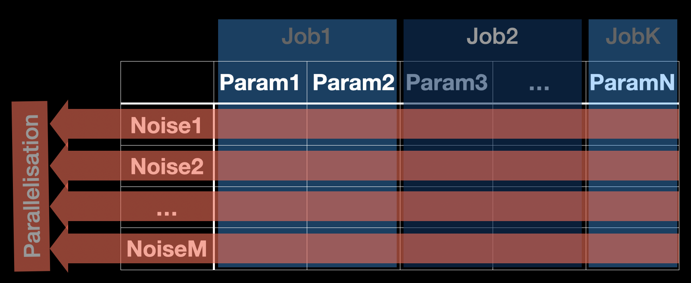
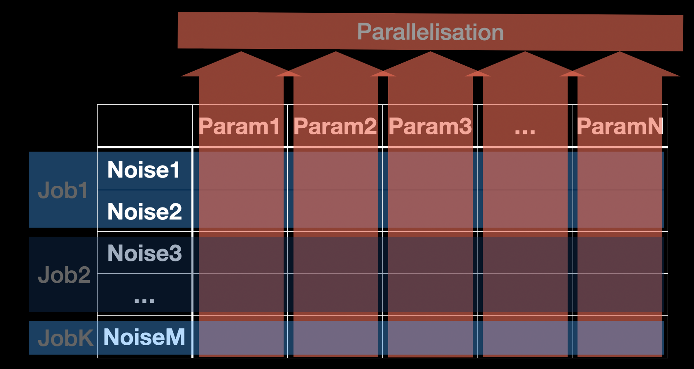

# MewtwoMegaEvo

##Intro
Mewtwo is a density matrix solver based on the Von-Neumann equation, integrated with symbolic gate and sequence parsing and compiling. 
Written in C++, this software is designed for very large scale qubits dynamic simulation by harnessing the power of parallelisation and job slicing for high performance computer.
In a nutshell, the core functionality of this software is to solve the time-dependent evolution of the density matrix with the provided time-dependent Hamiltonians.

## Installation

### Compiler & CMake Requirement
1. gcc-8.1+
2. g++-8.1+
3. gfortran-8.1+
3. CMake 11.0+
4. make

### Thrid party libs
1. [HDF5](https://www.hdfgroup.org/solutions/hdf5/) (Required by Armadillo, install before Armadillo)
2. [Armadillo](http://arma.sourceforge.net/download.html) 9.xxxx+ 
3. openMP (Embeded in gcc, No need to install manually)
4. Json (nlohmann::json Fetched by CMake, No need to install manually)
5. [RTTR](https://www.rttr.org)
6. Intel-MKL (Required by Armadillo)
7. OpenBlas (Required by Armadillo)
8. Lapack (Required by Armadillo)

### For Mac
If you have homebrew installed already, pre-compiled libs including armadillo, hdf5 can be installed easily by brew install command.

### For Linux

### For Windows
Enable Windows Linux Subsystem and see the [For Linux](#For-Linux)

## Design


### Symbolic gate and sequence
Lying on top of the architecture, symbolic gate sequence is the key to organise the timing logic of the Hamiltonians. We can put
any pre-defined gates into the sequence string, and even repeat some sub-sequence in the main sequence. As the minimum unit 
of a sequence, the symbolic gate is actually a intermediate layer to bridge the time-dependent Hamiltonians. When the sequence
string is successfully decoded, the gates will know when it will be switch on/off. This switching signal will be sent to gates'
corresponding Hamiltonians for generating the time-dependent Hamiltonians.

### Hamiltonians
Hamiltonian layer is the most intimate layer to the core solver. Time-dependent Hamiltonians are generated by pre-defined 
Hamiltonian prototypes and switching signal generated from the upper sequence-gate layer. Provided with four fundamental types
of Hamiltonians, which are static Hamiltonian (const amplitude), noise Hamiltonian (stochastic amplitude), AWG Hamiltonian 
(gated const amplitude) and Microwave Hamiltonian (gated sinusoidal amplitude). Specially, the noise Hamiltonian will fetch
n (number of repeat) different noise signal for each shot of simulation when it is enabled, and the time-dependent density 
matrix with will be averaged in the end.

### Parametric Sweeping
Parametric sweeping logic is managed by the Parameter Scheduler, which will fetch and update the parameters we want to change 
after each simulation cycle. The sweeping parameters can be specified in the json configuration file. All numerical fields 
for gate configuration and hamiltonian configuration, and alias symbol in sequence string are allowed to perform the parametric 
sweeping. The parameter vector is loaded from external text file within the same config directory. 

Multiple parameter sweeping is also supported by just adding more sweepable parameter information into the list. All the 
specified fields on the list will be updated after each cycle and simulation will restart with the renewed parameter value 
until finishing the last parameter in the vector. But those parameter vectors have to be the same length. 

Further, to make multi-dimensional parametric sweeping, each parameter vector (are not necessarily to be the same length) 
has to be spanned to be n-dimensional grid. 

### Parallelization
Mewtwo has implemented different levels and strategies of parallelization for various purposes of time-dependent simulations.
Since the simulation workload is majorly scaled up by repeating(if we have noise hamiltonian incorporated) and parametric
sweeping, proper parallelization can tremendously reduce the computation time.

The parallelization is on the repeat-wise by default, which means all the repeat of single-shot simulations
will be parallelized with different noise signals. That could be efficient when the number of repeat is larger than the 
number of working threads on your hosting computers. 

Parameter-wised parallelization will be efficient when the parameter space is larger than the number of threads, 
especially when the number of repeat is smaller than the number of threads available.

### Job slicing for high performance computer
When we need to launch very large scale simulation on HPCs, we may wish to slice the whole job into multiple submissions 
to different nodes to reduce the simulation time. Job slicing feature is aiming to provide a HPC-node level parallelization to further 
reduce the computation time. Computation time will depend on the most complicated simulation job if we slice the tasks to multiple
 jobs and submit all simultaneously. Then the load-balancing became critical to minimise the computation time. Provided with 
 ordered parameter vector, if the simulation complexity doesn't increase with the parameters, it's easy to 
divide the whole task into groups with same size. If the complexity growing with the parameter, then we will need a
 different strategy like logarithmic or reversed logarithmic slicing.

#### Job slicing strategy (Parameter-wise)

For example, if a parametric sweeping task has n parameters to sweep through. The whole task can be sliced into several 
groups by the strategies listed in the table below, so that HPC users can submit each sliced job to different HPC nodes.

Provided the number of the groups (jobs) you wish to submit in the [command arg (-g & -i)](#Command-args), and specify 
the strategy in the sim_config.json, then the simulation running on each job will know the range of the parameter vector
they are responsible for.

 e.x.: Task with n parameters will be sliced into g groups, then the end index of each job will be:
 
| strategy  | End index list for each job |
| ----------- | ----------- | 
| linspace | linspace(0,n,g+1) (Only non-repeated integers are perserved)|
| logspace | round(logspace(0,log10(n),g)), repeated indices shift by +1 (Only non-repeated integers are perserved)|
| inv_logspace | n - round(logspace(0,log10(n),g)), repeated indices shift by +1 (Only non-repeated integers are perserved)|

#### Job slicing strategy (Repeat-wise) (NOT AVAILABLE YET)


#### job slice shell script (job_slice.sh)
The shell script for generating qsub scripts for HPC job queue managing system is also provided in our software package.

## User guide
### Command args
The simulation can be launched as simple as type in './Mewtwo' command when you are in the working dir ./Playgroud/ if you
already have *config.json prepared in the default directory ./config_files/. And the output data and a copy of your configs
will be put in the ./sim_results/ by default. You can also specify the config file dir and output dir by -i and -o args.

For HPC users, when the tasks are sliced by specifying the "slicing_strategy" in sim_config.json, the -g and -i should 
be specified on each submission of the job. Otherwise those parameters will be 1 by default, which means no task slicing
are taken for that job submission. This package also provides the shellscript for generating scripts for qsub system.

We could also specify the timestamp manually by specifying the -t argument.
| arg  | arg name  | description |
| ----------- | ----------- | ----------- |
| -g | num_job_group | Num of the jobs [Job slicing for HPC](#Job-slicing-for-high-performance-computer) |
| -i | job_id | Index of the current job [Job slicing for HPC](#Job-slicing-for-high-performance-computer)  |
| -o | output_folder | Specifies the simulation result export path, /sim_results folder will be created at current dir by default. |
| -c | config_folder| Specifies the simulation configuration folder, /config_files at current dir by default|
| -t | timestamp | Force specifying the time stamp of the task, generated automatically by default |

### .json Configuration
All of the simulation configurations are defined by the .json file. General configs, gate configs and hamiltonian configs
 are defined separately in sim_configs.json, gate_config.json and hamiltonian_config.json.
#### sim_config.json
sim_config.json provides all the general configurations of the simulation.
```json5
{
  "task_name": "TwoQubitQNS",
  "log_level": 4,
  "job_slicing_strategy":"linspace",
  "enable_param_parallel_mode":false,
  "record_unitary": false,
  "record_all_meas": true,
  "system_dim": 4,
  "observables": ["IZ","IX"],
  "init_states": ["IZ","IY"],
  "repeat" : 64,
  "step_size": 1e-8,
  "sequence": "[F(T/4)-X1pi-F(T/2)-#a-F(T/4)]^#b-X1pi2-M",
  "sweep_param_info": [
    {
      "class":"Gate",
      "tag":"F",
      "property":"pulse_width",
      "val_file":"tau"
    },
    {
      "class":"Sequence",
      "tag":"#a",
      "property":"symbol_alias",
      "string_file":"gate1"
    },
    {
      "class":"Sequence",
      "tag":"#b",
      "property":"symbol_alias",
      "string_file":"repeatnum1"
    }
  ]
}
```
| field name  |  description |
| ----------- | ----------- |
| task_name | Defines task name |
| log_level | Controls the level of detail of the log output. Larger num will output more detailed log |
| job_slicing_strategy | "logspace", "linspace", "inv_logspace" See [Job slicing for HPC](#Job-slicing-for-high-performance-computer)  |
| record_unitary | Set true will output all of the unitary matrix generated on simulation (Time consuming) |
| record_all_meas | Set true, measurement will be taken at every time point |
| system_dim | Defines the dimension of the Hilbert space |
| observables | List of the observables (See also: [Symbolic/External matrix input](#symbolic-or-external-matrix-input)) |
| init_states | List of the density matrices at t=0 (See also: [Symbolic/External matrix input](#symbolic-or-external-matrix-input)) |
| repeat | Defines the num of repeat. (Same num of the noise realisations will be load to simulation, see also: Noise Hamiltonian) |
| step_size | Time resolution of the simulation in second. |
| sequence | Symbolic sequence string. (See also: [Symbolic Sequence definitions](#symbolic-sequence-definations)) |
| sweep_param_info | All the numeric fields in the gate and hamiltonian config files could be charged with parametric sweeping. See [parametric sweeping](#Parametric-Sweeping) |

#### gate_config.json
gate_config.json provides all the gate prototypes for building symbolic sequences for our simulation task.
Gate prototypes will only define the timing information and its corresponding Hamiltonians.
```json5
{  
  "gate_defs": [
    {
      "tag": "X1pi",
      "hamiltonians": ["X1"],
      "pulse_width": 1e-4,
      "ext_shaped_sig_path":""
    },
    {
      "tag": "X2pi",
      "hamiltonians": ["X2"],
      "pulse_width": 1e-4,
      "ext_shaped_sig_path":""
    },
    {
      "tag": "F",
      "hamiltonians": [],
      "pulse_width": 1e-4,
      "ext_shaped_sig_path":""
    }
  ]
}
```

| field name  |  description |
| ----------- | ----------- | 
| tag | Defines the symbol of the gate (See also: Symbolic Sequence definations) |
| hamiltonians | Mapping the gate to its corresponding Hamiltonians by its tag. |
| pulse_width | Defines the gate operation time length |
| ext_shaped_sig_path | The path of the external signal data file, signal data length has to be equal to pulse_width/step_size |

#### hamiltonian.json
```json5
{
  "hamiltonian_prototype_defs": [
    {
      "tag": "X1",
      "type": "mw",
      "enable": true,
      "amplitude":6.2831852e5,
      "freq": 0,
      "phase": 0,
      "h_pauli_mat": "IX",
      "waveform_path":""
    },
    {
      "tag": "X2",
      "type": "mw",
      "enable": true,
      "amplitude":1e4,
      "freq": 0,
      "phase": 1.5707963,
      "h_pauli_mat": "XI",
      "waveform_path":""
    },
    {
      "tag": "noise1",
      "type": "noise",
      "enable": false,
      "amplitude":1e2,
      "h_pauli_mat": "IZ",
      "lag_time": 1e-6,
      "waveform_path":"/Users/rockysu/mewtwo/mewtwo_executable/Darwin/NoiseData/PinkNoiseQ11#.csv"
    },
    {
      "tag": "noise2",
      "type": "noise",
      "enable": false,
      "amplitude":1e2,
      "h_pauli_mat": "ZI",
      "lag_time": 1e-6,
      "waveform_path":"/Users/rockysu/mewtwo/mewtwo_executable/Darwin/NoiseData/PinkNoiseQ21#.csv"
    }
  ]
}
```

| field name  |  description |
| ----------- | ----------- | 
| tag | Tag of the hamiltonian prototype |
| type | Hamiltonian type, could be specified as static, mw, awg and noise. (See also: [Hamiltonian types](#hamiltonian-types)) |
| enable | Switch for hamiltonian turning on/off |
| amplitude | Scaling the amplitude of the waveform |
| h_pauli_mat | Defines the hamiltonian matrix (See also: [Symbolic/External matrix input](#symbolic-or-external-matrix-input)) |
| waveform_path | Specify the external waveform data file path(in csv format) |

#### Parametric Sweeping
The field in the configurations you wish to perform parametric sweeping is located by the following format, for example:
```json5
  {
      "sweep_param_info":[
        {
          "class":"Gate",
          "tag":"F",
          "property":"pulse_width",
          "val_file":"tau"
        },
        {
          "class":"Sequence",
          "tag":"#b",
          "property":"symbol_alias",
          "string_file":"repeatnum1"
        }
      ]
  }
```

##### Sweeping Symbolic sequence by parametric alias

#### Symbolic or External matrix Input
Complex matrices in the json config files could be either defined as SU(n) spinor symbols or loaded from external csv file.
- e.x.
1. Symbol "XY" will be parsed to be the tensor product of pauli matrix X and Y. Spinor symbol pattern will be identified automatically. 
2. Symbol "rho1" is not identified as spinor symbol, so it will be loaded from ${config_folder}/rho1 in csv format.

#### Symbolic Sequence definations
Symbolic sequence module plays the key role in managing sequence. 
Sequences are compiled by the tags of the pre-defined gates in the gate_configs.json. 

##### Gate Symbol

##### Measurement Marker
Measurement marker "M", is a reserved gate symbol, which is a 0-width virtual gate for marking the position in the sequence 
you wish to make a measurement.

##### Symbolic sequence Grammars
1. Sub sequence wrapped by square braket "[]"
2. "[]^n" will repeat the sub sequence for n times.
3. Each symbolic gate in the sequence is separated by '-'.
4. Symbol alias prefixed by '#' will be replaced by the real symbol from sweeping param definations.
5. Expectation values results will be recorded at the time points where measurement markers assigned.
- e.x.
```
Sequence_string: F(T/4)-[U1-U2]^2-U2-F(T/4)-#projgate
Result: F(T/4), U1, U2, U1, U2, U2, F(T/4), Xpi2
Where, the gate symbols are decomposed to tag-param pair, for e.x., F(T/4) will be decomposed to "F" : "T/4",
T is the gate time defined in gate_config.json.
Where, the alias symbol, #projgate, is replaced by real symbol on runtime.
```
NOTE: Symbol "M" is reserved as measurement marker.

#### Hamiltonian types
##### Static Hamiltonian
##### Microwave Hamiltonian
##### AWG Hamiltonian
Coming Soon
##### Noise Hamiltonian

## Output data
Output result data will be saved as HDF5 file.

Data structure tree diagram:
```
|-Dataset|
         |-param1-|
         |-param2-|
            ...
         |-paramN-|
                  |-time_vec-|
                  |-Observable1-|
                  |-Observable2-|
                       ...
                  |-ObservableN-|
                                |-rho1-|
                                |-rho2-|
                                |-rho3-|
                                  ...
```